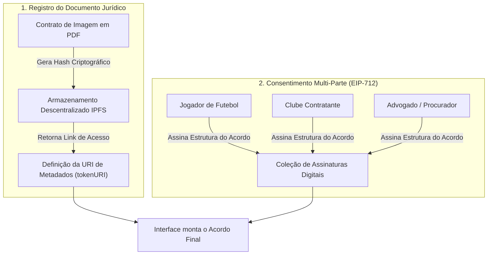
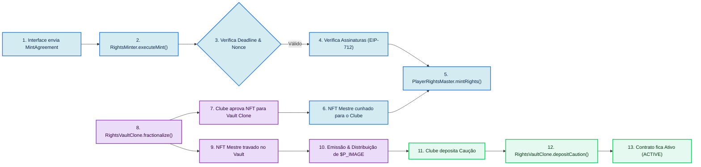
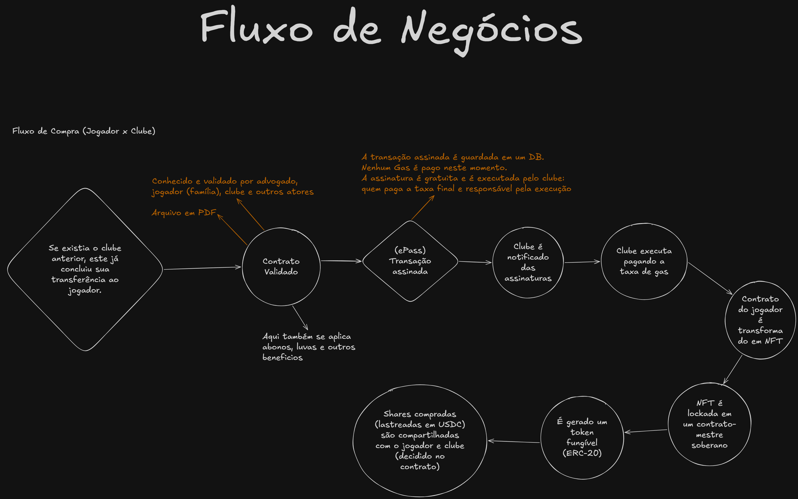
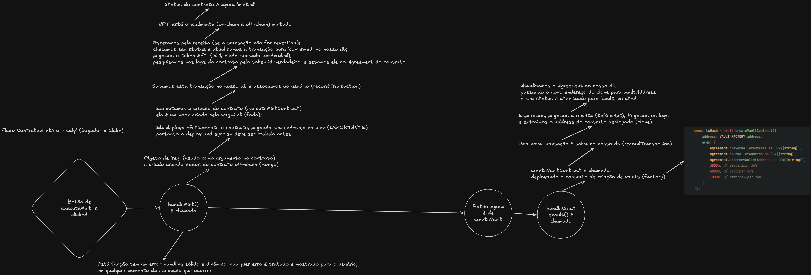
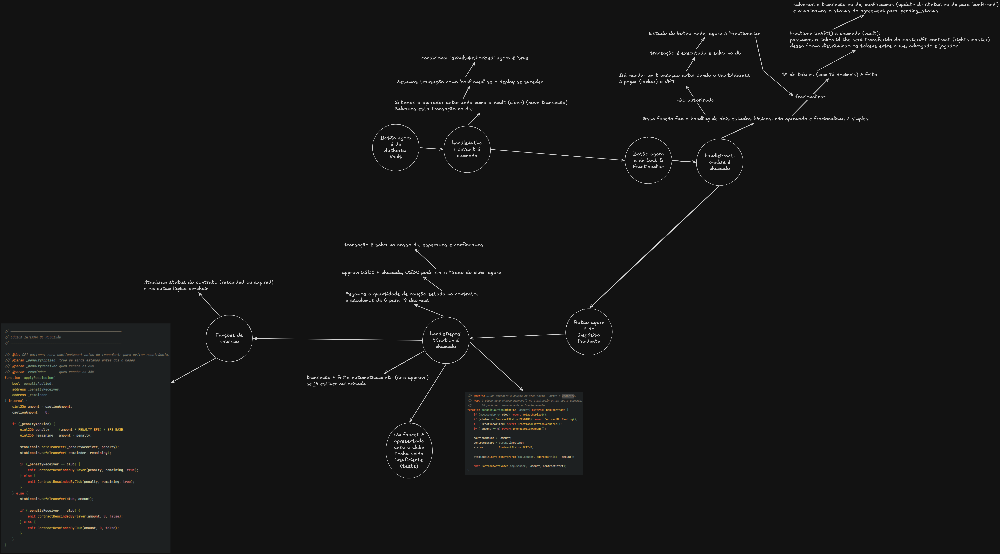

<p align="center">
  
</p>

<h1 align="center">
   ePass
</h1>

<p align="center">
  <strong>Tokenizando o contrato do atleta. Valorizando seu futuro.</strong>
</p>

O ePass é um projeto concebido durante o _**HackaWeb3 - Impact Ledger**_ promovido pelo [iRede](https://irede.org.br/), desde já nossos agradecimentos pela oportunidade!

---

# 🗺️ Índice do Projeto

Este índice apresenta todas as páginas disponíveis neste repositório, divididas entre apresentação da plataforma e documentação técnica/de negócios:

### 📖 Apresentação
* [README (Esta Página)](./README.md) - Visão geral do ecossistema ePass, arquitetura de contratos, fluxo do protocolo e instruções de uso.
* [Fluxo de Negócios (Business Flow)](./docs/assets/business-flow.png) - Mapeamento de regras de negócios, stakeholders e fluxo financeiro geral do ePass.
* [Fluxo Técnico 1 (Smart Contracts)](./docs/assets/flow1.png) - Diagrama técnico detalhado do deploy, assinaturas EIP-712 e fracionamento.
* [Fluxo Técnico 2 (Ciclo de Vida)](./docs/assets/flow2.png) - Diagrama detalhado do ciclo de vida dos cofres (active, penalty, rescind, expire).
* [Guia de Contribuição (Contributing)](./CONTRIBUTING.md) - Instruções para reportar bugs, sugerir melhorias e enviar contribuições de código (Bilingue: PT/EN).
* [Licença MIT (License)](./LICENSE) - Termos de licenciamento de software livre do projeto ePass.

### 📚 Documentos (Docs)
* [Doc completa no Gitbook](https://epass.gitbook.io/epass-docs/) - Documentação completa organizada, com suporte de IA para explicações diretas ao ponto.
* [Sobre o ePass](./docs/pt-br/about.md) - O problema do mercado de direitos de imagem e a nossa proposta de solução.
* [Fluxo para Clubes](./docs/pt-br/clubs.md) - Como a plataforma e o sistema de garantia funcionam do ponto de vista do clube.
* [Fluxo para Jogadores](./docs/pt-br/players.md) - Regras de negócio, direitos e controle financeiro do ponto de vista do atleta.
* [Guia do Desenvolvedor (Início)](./docs/pt-br/developers/readme.md) - Como rodar o repositório localmente e entender a stack de desenvolvimento.
* [Arquitetura de Smart Contracts](./docs/pt-br/developers/contracts.md) - A lógica detalhada de cada contrato inteligente singleton e proxy clone.
* [Decisões de Design & Interface](./docs/pt-br/developers/design.md) - A filosofia visual do ePass e padrões estéticos adotados.
* [Sessão & Segurança (Auth)](./docs/pt-br/developers/auth.md) - Como a autenticação via NextAuth, cookies JWT e sessões funcionam de ponta a ponta.
* [Padrões & Diretrizes](./docs/pt-br/developers/guidelines.md) - Regras de linting, formatação e commits do projeto.
* [Pontos em Discussão](./docs/pt-br/developers/discussion.md) - Detalhes sobre upgrades futuros, oráculos e melhorias pendentes.
* [Mini Doc Técnica - 1](./refs/TECH-DOC.md) - Detalhes sobre a arquitetura dos contratos inteligentes, chamadas de funções e fluxo geral de integração no frontend.
* [Mini Doc Técnica - 2](./refs/TECH-DOC-2.md) - Análise detalhada do ciclo de vida, proxies mínimos (clones), verificação EIP-712, segurança e integração de UI.
* [Guia de Testes Automatizados](./docs/pt-br/tests.md) - Explicação aprofundada da arquitetura e execução de testes Foundry, Vitest e Playwright BDD.

---


O ePass é um dApp para formalização, registro e fracionamento de direitos de imagem de jovens atletas de futebol. A solução usa blockchain para transformar um acordo jurídico assinado entre atleta, clube e advogado em um ativo digital auditável, verificável e fracionável. Por meio de smart contracts, assinaturas multi-parte e um fluxo de validação on-chain, o ePass garante transparência, segurança jurídica e um mecanismo real de valorização de mercado para jogadores em início de carreira.

O protocolo se apoia em cinco contratos: um gateway de assinaturas EIP-712, um NFT mestre que representa o direito registrado, um contrato de implementação de cofre com lógica financeira completa (fracionamento, caução, rescisão e expiração) e uma factory que instancia um vault independente por jogador via EIP-1167 minimal proxy.

---

## 📌 O Problema

Quando um jovem atleta assina seu primeiro contrato profissional, dois documentos são produzidos: o contrato de trabalho e o contrato de direito de imagem. O segundo costuma ter pouca padronização, baixa auditabilidade e pouca visibilidade pública. O atleta nem sempre tem controle claro sobre o que está sendo cedido.

Jogadores em início de carreira geralmente possuem contratos de baixo valor nominal, o que reduz sua capacidade de gerar interesse de mercado antes de uma grande transferência. Na prática, dependem quase exclusivamente da visibilidade que o clube decide — ou não — promover.

**O ePass foi criado para resolver esse problema.**

---

## 💡 A Solução

O ePass digitaliza e registra o contrato de direito de imagem on-chain, com respaldo em IPFS. O acordo passa a ter rastreabilidade pública e pode ser validado criptograficamente pelas partes envolvidas.

Com o contrato registrado, o vault emite os tokens `$P_IMAGE` — frações digitais vinculadas ao contrato. A distribuição respeita os percentuais negociados entre jogador, clube e advogado via basis points. A lógica não é especulativa: o foco está em criar uma estrutura de incentivo, visibilidade e valorização para talentos em formação.

---

## 🏗️ Arquitetura de Smart Contracts

O protocolo é composto por cinco contratos, implantados na **Sepolia Testnet**.

| Contrato | Tipo | Instâncias |
| :-- | :-- | :-- |
| `RightsMinter` | Gateway EIP-712 | Singleton |
| `PlayerRightsMaster` | ERC-721 NFT mestre | Singleton |
| `RightsVaultImpl` | Lógica do cofre (implementação) | Singleton |
| `RightsVaultFactory` | Factory EIP-1167 | Singleton |
| Clone do vault | Proxy mínimo por jogador | Uma por contrato |

> **Observação:** `RightsMinter`, `PlayerRightsMaster`, `RightsVaultImpl` e `RightsVaultFactory` são deployados **uma única vez** e seus endereços ficam fixos no `.env`. Cada chamada a `factory.createVault(...)` gera um **novo clone** com endereço próprio — esse endereço deve ser capturado via evento `VaultCreated` emitido pela factory.

---

## 🔄 Fluxo Off-Chain



---

## ⛓️ Fluxo On-Chain



---

## 🎨 Diagramas de Mapeamento (Excalidraw)

Abaixo estão os mapeamentos visuais do ecossistema ePass desenvolvidos no Excalidraw, divididos entre dinâmica de negócios, arquitetura técnica e ciclo financeiro dos cofres:

### 💼 1. Fluxo de Negócios (Business Flow)
Mapeia os papéis dos envolvidos (atleta, clube e advogado), a dinâmica de distribuição de tokens e as regras financeiras macro.

<p align="center">
  
</p>

### ⛓️ 2. Fluxo Técnico 1 (Smart Contracts & Deploy)
Mostra o fluxo de assinaturas EIP-712 off-chain, validação e mint no `RightsMinter`, além do clone de vaults via `Clones` (ERC-1167).

<p align="center">
  
</p>

### ⏱️ 3. Fluxo Técnico 2 (Ciclo de Vida do Cofre & Escrow)
Mapeia as transações on-chain de depósito de caução, fracionamento, resgates e regras para os estados de ACTIVE, RESCINDED e EXPIRED.

<p align="center">
  
</p>


---

## 📄 Papel de Cada Contrato

### RightsMinter

Gateway que centraliza a autorização criptográfica do acordo. Implementa EIP-712 para assinar e verificar a estrutura `MintAgreement`, contendo jogador, clube, advogado, URI do documento, nonce e deadline. Após validar as três assinaturas, dispara o mint do NFT mestre para o clube.

### PlayerRightsMaster

Contrato ERC-721 que representa o direito de imagem registrado. Cada token corresponde a um acordo validado e carrega uma `tokenURI` com referência ao documento jurídico. Apenas o endereço configurado como `authorizedMinter` pode emitir novos tokens. Transferências diretas via `transferFrom` padrão são bloqueadas — apenas operadores autorizados explicitamente podem movimentar NFTs.

### RightsVaultImpl

Contrato de implementação (lógica) do cofre. Não pode ser usado diretamente — o `constructor()` chama `_disableInitializers()` para proteger o contrato. Toda lógica reside aqui e é compartilhada por todos os clones via EIP-1167.

Responsabilidades:
- travar o NFT mestre;
- emitir os tokens `$P_IMAGE` distribuídos por basis points entre jogador, clube e advogado;
- guardar e controlar a caução em stablecoin;
- tratar rescisão com penalidade proporcional ao momento do contrato;
- tratar expiração natural após 12 meses;
- permitir transferência de titularidade entre clubes.

### RightsVaultFactory

Factory que cria novos vaults via `Clones.clone()` (EIP-1167 minimal proxy). Cada vault criado tem seu próprio storage, mas compartilha o bytecode da implementação. A factory também armazena os endereços de `PlayerRightsMaster` e da stablecoin, repassando-os na inicialização de cada clone.

---

## 🚦 Estados do Contrato (Vault)

| Status | Descrição |
| :-- | :-- |
| `PENDING` | Vault criado. Aguardando fracionamento e depósito da caução. |
| `ACTIVE` | Caução depositada. Contrato em pleno vigor. |
| `RESCINDED` | Rescisão executada por jogador ou clube, com penalidade aplicada conforme o semestre. |
| `EXPIRED` | Contrato encerrado naturalmente após 12 meses. Caução devolvida ao clube. |
| `TRANSFERRED` | Titularidade operacional transferida para outro clube. |

---

## ⚙️ Como a Solução Funciona

**1. Registro off-chain**
O contrato jurídico é negociado entre jogador, clube e advogado. O documento é armazenado em IPFS e sua URI é usada como `tokenURI` do NFT.

**2. Assinaturas EIP-712**
O frontend monta a estrutura `MintAgreement` com os endereços das três partes, a `tokenURI`, o nonce e o deadline. Cada parte assina sem precisar pagar gas.

**3. Mint do NFT mestre**
O `RightsMinter` valida deadline, nonce e autenticidade das três assinaturas. Aprovado, chama `PlayerRightsMaster.mintRights(...)` e o NFT mestre é emitido para o clube.

**4. Criação do vault**
A factory cria um clone do `RightsVaultImpl` via `factory.createVault(...)`, passando os endereços das partes, os basis points de cada fatia e o nome/símbolo do token daquele contrato específico. O endereço do vault gerado é emitido no evento `VaultCreated`.

**5. Fracionamento**
O clube aprova o vault no `PlayerRightsMaster` e chama `fractionalize(tokenId, supply)`. O vault trava o NFT e distribui os tokens `$P_IMAGE` proporcionalmente:
- Jogador recebe `supply × playerBps / 10.000`
- Clube recebe `supply × clubBps / 10.000`
- Advogado recebe `supply × attorneyBps / 10.000`

**6. Ativação**
O clube aprova a stablecoin no vault e chama `depositCaution(amount)`. O contrato entra em `ACTIVE`.

**7. Ciclo de vida**
A partir daí o fluxo pode seguir para rescisão pelo jogador, rescisão pelo clube, expiração natural ou transferência de clube.

---

## ⚖️ Regras de Rescisão

| Cenário | Antes de 6 meses | Após 6 meses |
| :-- | :-- | :-- |
| Rescisão pelo jogador | 65% da caução vai ao clube, 35% ao jogador | Caução integral devolvida ao clube |
| Rescisão pelo clube | 65% da caução vai ao jogador, 35% ao clube | Caução integral devolvida ao clube |
| Expiração (12 meses) | — | Caução integral devolvida ao clube |

---

## 🛡️ Segurança

- Apenas o minter autorizado pode criar novos NFTs no `PlayerRightsMaster`.
- Transferência direta de NFT via `transferFrom` padrão é bloqueada — apenas operadores autorizados explicitamente podem mover o ativo.
- O `RightsMinter` rejeita acordos com deadline expirado.
- O `RightsMinter` usa nonce por acordo para prevenir replay de assinatura.
- O `RightsMinter` valida que cada assinatura corresponde exatamente ao endereço esperado.
- O `RightsVaultImpl` usa `_disableInitializers()` no constructor — a implementação nunca pode ser inicializada diretamente.
- O vault só aceita fracionamento se o chamador for o dono atual do NFT.
- O vault usa o padrão CEI (Checks-Effects-Interactions) nas funções de rescisão para prevenir reentrância.
- O vault usa `ReentrancyGuard` do OpenZeppelin nas funções de movimentação financeira.
- A factory valida basis points na criação (`playerBps + clubBps + attorneyBps == 10.000`).

---

## 🛠️ Stack

O ecossistema ePass é construído sobre as seguintes tecnologias:

| Camada | Tecnologia | Descrição |
| :--- | :--- | :--- |
| **Smart Contracts** | Solidity `^0.8.24` | Linguagem de desenvolvimento dos contratos inteligentes do protocolo |
| **Padrões On-chain** | ERC-721, ERC-20, EIP-712, EIP-1167 | NFTs mestres, tokens fracionários, assinaturas off-chain estruturadas e clones de baixo consumo de gas |
| **Framework Blockchain** | Foundry (Forge, Cast, Anvil) | Orquestrador de deploys, testes unitários, scripts Solidity e simulação local de EVM |
| **Segurança On-chain** | OpenZeppelin Contracts v5 | Implementações de bibliotecas padrão de tokens, proxies seguros e proteção contra reentrância |
| **Armazenamento** | IPFS (Pinata SDK) | Hospedagem distribuída, pública e imutável para os documentos legais dos contratos em PDF |
| **Frontend Core** | React 19 & Next.js 16 (App Router) | Interface rica e dinâmica operada via componentes do lado cliente e servidor |
| **Estilização** | Tailwind CSS v4 & PostCSS | Biblioteca de utilidades estilísticas modernas e tema customizado em OKLCH |
| **Segurança & Sessão** | NextAuth.js & Google OAuth | Login social de usuários sincronizado a uma sessão persistida e criptografada via cookies JWT |
| **Integração Web3** | Wagmi / Viem & RainbowKit | Hooks tipados para interação RPC, assinatura EIP-712 e modais estéticos de conexão de carteiras |
| **Banco de Dados** | MongoDB & Mongoose | Banco de dados NoSQL local para o cadastro de contas, onboardings e cache de metadados |
| **Linter / Formatter** | Biome | Ferramenta centralizada para análise estática e padronização visual de sintaxe TypeScript/JavaScript |
| **Visualizações** | Recharts | Renderização de gráficos e evolução de contratos nos painéis de controle administrativos |
| **Gerenciadores** | pnpm `v11.5.1` & yarn `v4.7.0` | Orquestradores rápidos de dependências no frontend (`epass-web`) e explorer (`/explorer`) |
| **Ambientes Locais** | Docker & Docker Compose | Inicializador da infraestrutura de desenvolvimento (banco de dados e visualizador web) |
| **Visualizador MongoDB** | Compooss | Interface web simplificada de exploração de registros do banco na porta `6969` |

---

## 📂 Estrutura do Repositório

```
ePass/
├── anvil/                      # Configurações do node blockchain local Anvil
├── docs/                       # Documentação Gitbook (en, pt-br)
├── explorer/                   # Explorador de blocos local (Vite/React/Yarn)
├── mock-data/                  # Dados falsos e mocks para testes
├── scripts/                    # Scripts utilitários gerais
├── src/                        # Código-fonte principal do projeto
│   ├── docker-compose.yml      # Banco MongoDB e interface Compooss (porta 6969)
│   ├── smart-contracts/        # Backend e Smart Contracts (Foundry/Solidity)
│   │   ├── src/                # Código Solidity (RightsMinter, PlayerRightsMaster, etc.)
│   │   ├── script/             # Scripts de deploy e simulação em Solidity
│   │   └── test/               # Testes Foundry (.t.sol)
│   └── epass-web/              # Web App Frontend (Next.js 16 / React 19 / pnpm)
└── README.md
```

---

## 🧪 Testes

O ePass conta com uma suite de testes robusta e automatizada cobrindo a camada de contratos inteligentes (smart contracts), testes unitários e hooks de frontend, além de testes de comportamento de ponta a ponta (E2E/BDD).

A explicação técnica detalhada de cada suite de teste e a arquitetura das validações podem ser encontradas no guia de documentação:
* [Guia de Testes Automatizados](./docs/pt-br/tests.md)

### Executando os Testes

Para rodar os testes de cada camada de forma rápida:

**Smart Contracts (Foundry):**
```bash
cd src/smart-contracts
forge test -vv
```

**Frontend (Vitest):**
```bash
cd src/epass-web
pnpm run test
```

**End-to-End (Playwright & BDD):**
```bash
cd src/epass-web
pnpm run test:e2e
```

---

## 📍 Endereços na Sepolia

| Contrato | Endereço |
| :-- | :-- |
| `Mock USDC` | `0x425fFDE215AD4B2c6Ae83D4acD140a88fd3306A7` |
| `RightsMinter` | `0x4ba2F61B0Aee99ec9340D23A3E231D6aE076B15b` |
| `PlayerRightsMaster` | `0x11F3d779cF39BC845a31c952d2dA30b2962dD421` |
| `RightsVaultImpl` | `0x30c8b0895cDFE28271Db6ef92136b73c308e6394` |
| `RightsVaultFactory` | `0x2273ae0ff0189D54D7EBcf3AD27FC6BB28857005` |

> Vaults individuais (clones) são criados dinamicamente via factory. O endereço de cada vault é emitido no evento `VaultCreated(address vault, address player, address club, ...)` e deve ser indexado pelo frontend ou backend.

---

## 📺 Demonstração

```bash
# Navegar até a pasta dos smart-contracts
cd src/smart-contracts

# Configurar a chave privada de deploy ($PRIVATE_KEY) e a URL RPC da rede (ex: Sepolia)
export PRIVATE_KEY=0x...
export SEPOLIA_RPC_URL=https://...

# Deploy dos contratos singleton (carrega a chave de forma dinâmica do ambiente)
forge script script/Deploy.s.sol:Deploy --rpc-url $SEPOLIA_RPC_URL --broadcast -vvvv

# Simulação completa do pipeline
forge script script/SimulatePipeline.s.sol:SimulatePipeline --rpc-url $SEPOLIA_RPC_URL --broadcast -vvvv
```

---

## 👥 Equipe e Responsabilidades

| Membro | Responsabilidade |
| :---: | :--- |
| <br/>**[Vinicius](https://github.com/wnccys)** | Integração Front/Backend · Definição da Arquitetura · Documentação |
| <br/>**[Matheus](https://github.com/RosettiBR)** | Smart Contracts · Pitch · Documentação |
| <br/>**[Janiel](https://github.com/Janiel-Gomes)** | Testes (E2E/Vitest) · Auditorias de Segurança |

---

## 🚀 Próximos Passos

- Implementação do nosso próprio oráculo, para cálculos de abonos e luvas em cima de dados reais e dinâmicos.
- Implementação de mercado interno para compra de tokens emitidos on-app.
- Implementação de vínculos maiores de conformidade contratual (customizações) na criação de contratos.

