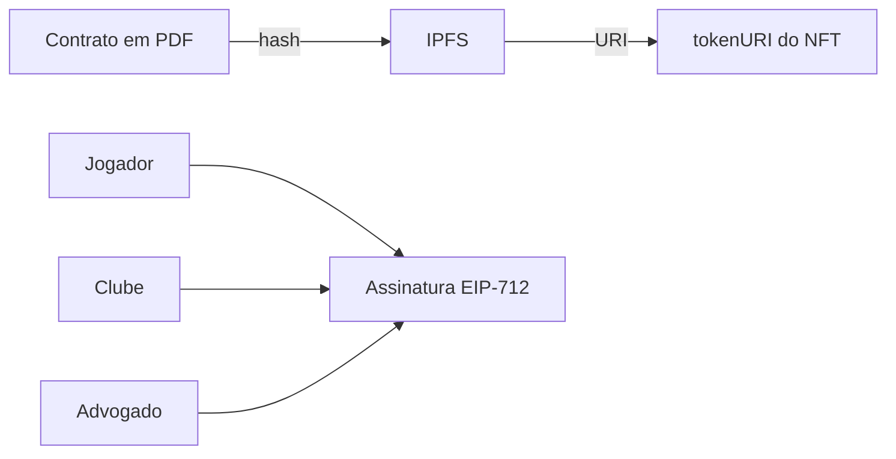
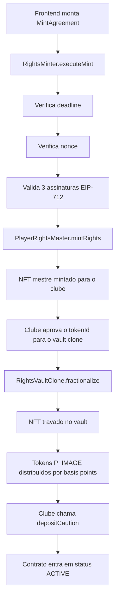

# ePass ⚽

> **Tokenizando o contrato do atleta. Valorizando seu futuro.**

O ePass é um dApp para formalização, registro e fracionamento de direitos de imagem de jovens atletas de futebol. A solução usa blockchain para transformar um acordo jurídico assinado entre atleta, clube e advogado em um ativo digital auditável, verificável e fracionável. Por meio de smart contracts, assinaturas multi-parte e um fluxo de validação on-chain, o ePass garante transparência, segurança jurídica e um mecanismo real de valorização de mercado para jogadores em início de carreira.

O protocolo se apoia em cinco contratos: um gateway de assinaturas EIP-712, um NFT mestre que representa o direito registrado, um contrato de implementação de cofre com lógica financeira completa (fracionamento, caução, rescisão e expiração) e uma factory que instancia um vault independente por jogador via EIP-1167 minimal proxy.

---

## O Problema

Quando um jovem atleta assina seu primeiro contrato profissional, dois documentos são produzidos: o contrato de trabalho e o contrato de direito de imagem. O segundo costuma ter pouca padronização, baixa auditabilidade e pouca visibilidade pública. O atleta nem sempre tem controle claro sobre o que está sendo cedido.

Jogadores em início de carreira geralmente possuem contratos de baixo valor nominal, o que reduz sua capacidade de gerar interesse de mercado antes de uma grande transferência. Na prática, dependem quase exclusivamente da visibilidade que o clube decide — ou não — promover.

**O ePass foi criado para resolver esse problema.**

---

## A Solução

O ePass digitaliza e registra o contrato de direito de imagem on-chain, com respaldo em IPFS. O acordo passa a ter rastreabilidade pública e pode ser validado criptograficamente pelas partes envolvidas.

Com o contrato registrado, o vault emite os tokens `$P_IMAGE` — frações digitais vinculadas ao contrato. A distribuição respeita os percentuais negociados entre jogador, clube e advogado via basis points. A lógica não é especulativa: o foco está em criar uma estrutura de incentivo, visibilidade e valorização para talentos em formação.

---

## Arquitetura de Smart Contracts

O protocolo é composto por cinco contratos, implantados na **Sepolia Testnet**.

| Contrato | Tipo | Instâncias |
| :-- | :-- | :-- |
| `RightsMinter` | Gateway EIP-712 | Singleton |
| `PlayerRightsMaster` | ERC-721 NFT mestre | Singleton |
| `RightsVaultImpl` | Lógica do cofre (implementação) | Singleton |
| `RightsVaultFactory` | Factory EIP-1167 | Singleton |
| Clone do vault | Proxy mínimo por jogador | Uma por contrato |

> **Observação:** `RightsMinter`, `PlayerRightsMaster`, `RightsVaultImpl` e `RightsVaultFactory` são deployados **uma única vez** e seus endereços ficam fixos no `.env`. Cada chamada a `factory.createVault(...)` gera um **novo clone** com endereço próprio — esse endereço deve ser capturado via evento `VaultCreated` emitido pela factory.

---

## Fluxo off-chain



---

## Fluxo on-chain



---

## Papel de Cada Contrato

### RightsMinter

Gateway que centraliza a autorização criptográfica do acordo. Implementa EIP-712 para assinar e verificar a estrutura `MintAgreement`, contendo jogador, clube, advogado, URI do documento, nonce e deadline. Após validar as três assinaturas, dispara o mint do NFT mestre para o clube.

### PlayerRightsMaster

Contrato ERC-721 que representa o direito de imagem registrado. Cada token corresponde a um acordo validado e carrega uma `tokenURI` com referência ao documento jurídico. Apenas o endereço configurado como `authorizedMinter` pode emitir novos tokens. Transferências diretas via `transferFrom` padrão são bloqueadas — apenas operadores autorizados explicitamente podem movimentar NFTs.

### RightsVaultImpl

Contrato de implementação (lógica) do cofre. Não pode ser usado diretamente — o `constructor()` chama `_disableInitializers()` para proteger o contrato. Toda lógica reside aqui e é compartilhada por todos os clones via EIP-1167.

Responsabilidades:
- travar o NFT mestre;
- emitir os tokens `$P_IMAGE` distribuídos por basis points entre jogador, clube e advogado;
- guardar e controlar a caução em stablecoin;
- tratar rescisão com penalidade proporcional ao momento do contrato;
- tratar expiração natural após 12 meses;
- permitir transferência de titularidade entre clubes.

### RightsVaultFactory

Factory que cria novos vaults via `Clones.clone()` (EIP-1167 minimal proxy). Cada vault criado tem seu próprio storage, mas compartilha o bytecode da implementação. A factory também armazena os endereços de `PlayerRightsMaster` e da stablecoin, repassando-os na inicialização de cada clone.

---

## Estados do Contrato (Vault)

| Status | Descrição |
| :-- | :-- |
| `PENDING` | Vault criado. Aguardando fracionamento e depósito da caução. |
| `ACTIVE` | Caução depositada. Contrato em pleno vigor. |
| `RESCINDED` | Rescisão executada por jogador ou clube, com penalidade aplicada conforme o semestre. |
| `EXPIRED` | Contrato encerrado naturalmente após 12 meses. Caução devolvida ao clube. |
| `TRANSFERRED` | Titularidade operacional transferida para outro clube. |

---

## Como a Solução Funciona

**1. Registro off-chain**
O contrato jurídico é negociado entre jogador, clube e advogado. O documento é armazenado em IPFS e sua URI é usada como `tokenURI` do NFT.

**2. Assinaturas EIP-712**
O frontend monta a estrutura `MintAgreement` com os endereços das três partes, a `tokenURI`, o nonce e o deadline. Cada parte assina sem precisar pagar gas.

**3. Mint do NFT mestre**
O `RightsMinter` valida deadline, nonce e autenticidade das três assinaturas. Aprovado, chama `PlayerRightsMaster.mintRights(...)` e o NFT mestre é emitido para o clube.

**4. Criação do vault**
A factory cria um clone do `RightsVaultImpl` via `factory.createVault(...)`, passando os endereços das partes, os basis points de cada fatia e o nome/símbolo do token daquele contrato específico. O endereço do vault gerado é emitido no evento `VaultCreated`.

**5. Fracionamento**
O clube aprova o vault no `PlayerRightsMaster` e chama `fractionalize(tokenId, supply)`. O vault trava o NFT e distribui os tokens `$P_IMAGE` proporcionalmente:
- Jogador recebe `supply × playerBps / 10.000`
- Clube recebe `supply × clubBps / 10.000`
- Advogado recebe `supply × attorneyBps / 10.000`

**6. Ativação**
O clube aprova a stablecoin no vault e chama `depositCaution(amount)`. O contrato entra em `ACTIVE`.

**7. Ciclo de vida**
A partir daí o fluxo pode seguir para rescisão pelo jogador, rescisão pelo clube, expiração natural ou transferência de clube.

---

## Regras de Rescisão

| Cenário | Antes de 6 meses | Após 6 meses |
| :-- | :-- | :-- |
| Rescisão pelo jogador | 65% da caução vai ao clube, 35% ao jogador | Caução integral devolvida ao clube |
| Rescisão pelo clube | 65% da caução vai ao jogador, 35% ao clube | Caução integral devolvida ao clube |
| Expiração (12 meses) | — | Caução integral devolvida ao clube |

---

## Segurança

- Apenas o minter autorizado pode criar novos NFTs no `PlayerRightsMaster`.
- Transferência direta de NFT via `transferFrom` padrão é bloqueada — apenas operadores autorizados explicitamente podem mover o ativo.
- O `RightsMinter` rejeita acordos com deadline expirado.
- O `RightsMinter` usa nonce por acordo para prevenir replay de assinatura.
- O `RightsMinter` valida que cada assinatura corresponde exatamente ao endereço esperado.
- O `RightsVaultImpl` usa `_disableInitializers()` no constructor — a implementação nunca pode ser inicializada diretamente.
- O vault só aceita fracionamento se o chamador for o dono atual do NFT.
- O vault usa o padrão CEI (Checks-Effects-Interactions) nas funções de rescisão para prevenir reentrância.
- O vault usa `ReentrancyGuard` do OpenZeppelin nas funções de movimentação financeira.
- A factory valida basis points na criação (`playerBps + clubBps + attorneyBps == 10.000`).

---

## Testes

O projeto conta com suíte de testes cobrindo os três contratos principais.

```
Ran 18 tests for test/RightsVault.t.sol       ✅ 18 passed
Ran 6 tests  for test/RightsMinter.t.sol       ✅  6 passed
Ran 6 tests  for test/PlayerRightsMaster.t.sol ✅  6 passed

30 tests passed, 0 failed
```

Para rodar:

```bash
forge test -vv
```

---

## Stack

| Camada | Tecnologia |
| :-- | :-- |
| Smart Contracts | Solidity ^0.8.24, OpenZeppelin v5 |
| Padrões on-chain | ERC-721, ERC-20, EIP-712, EIP-1167 |
| Framework de Dev | Foundry (Forge, Cast, Anvil) |
| Armazenamento off-chain | IPFS |
| Rede | Sepolia Testnet |
| Frontend | Next.js + React |
| Web3 | Wagmi / Viem, MetaMask |
| Multi-sig | Gnosis Safe |

---

## Estrutura do Repositório

```
epass/
├── src/
│   ├── RightsMinter.sol          # Gateway de autorização multi-parte (EIP-712)
│   ├── PlayerRightsMaster.sol    # NFT mestre ERC-721
│   ├── RightsVaultImpl.sol       # Lógica do cofre — implementação compartilhada
│   ├── RightsVaultFactory.sol    # Factory EIP-1167 para criação de vaults por jogador
│   └── MockUSDC.sol              # Stablecoin mock para testes locais
├── script/
│   ├── Deploy.s.sol              # Deploy dos contratos singleton
│   └── SimulatePipeline.s.sol    # Simulação end-to-end do fluxo completo
├── test/
│   ├── PlayerRightsMaster.t.sol
│   ├── RightsMinter.t.sol
│   └── RightsVault.t.sol
├── epass-web/
│   └── (Next.js — em desenvolvimento)
└── README.md
```

---

## Endereços na Sepolia

| Contrato | Endereço |
| :-- | :-- |
| `RightsMinter` | *(a publicar)* |
| `PlayerRightsMaster` | *(a publicar)* |
| `RightsVaultImpl` | *(a publicar)* |
| `RightsVaultFactory` | *(a publicar)* |

> Vaults individuais (clones) são criados dinamicamente via factory. O endereço de cada vault é emitido no evento `VaultCreated(address vault, address player, address club, ...)` e deve ser indexado pelo frontend ou backend.

---

## Demonstração

```bash
# Deploy dos contratos singleton
forge script script/Deploy.s.sol --rpc-url sepolia --broadcast

# Simulação completa do pipeline
forge script script/SimulatePipeline.s.sol --rpc-url sepolia --broadcast
```

| Item | Link |
| :-- | :-- |
| Smart Contracts (Sepolia) | *(endereço a publicar)* |
| Aplicação | *(link a publicar)* |
| Vídeo Demo | *(a publicar)* |

---

## Próximos Passos

- 
-  
- 
- 
- 
