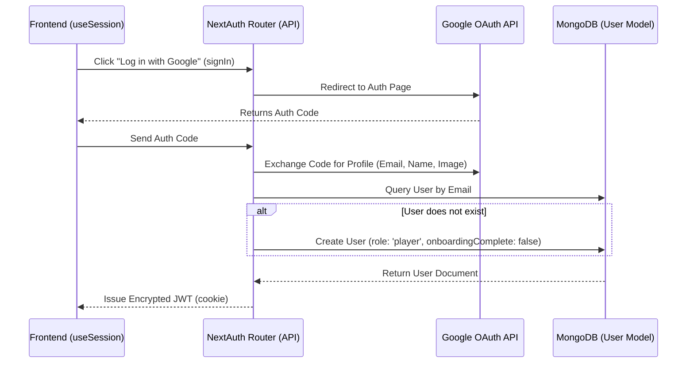

# Authentication Architecture: Google OAuth, MongoDB, & Wallet Sync

This document details how authentication, user creation, role assignment, and wallet address synchronization work in **ePass** using NextAuth, Mongoose/MongoDB, and JWT.

---

## 1. Authentication & User Creation Flow

When a user signs in via Google OAuth, the backend maps their identity to a MongoDB document.

### Flow Breakdown
1. **Trigger**: The frontend calls `signIn("google")`.
2. **Handshake**: NextAuth handles redirecting the browser to Google OAuth consent and receives the user profile (email, name, image).
3. **Database Check & User Creation**:
   * NextAuth intercepts this in the `jwt` callback (`account` and `user?.email` present on initial login).
   * It runs `dbConnect()` and queries `User.findOne({ email: user.email })`.
   * If the user doesn't exist, a new user document is created with a default role of `'player'`, and `onboardingComplete: false`.
4. **Token Generation**: The database `_id` is converted to a string and assigned to `token.id`. The user's role is stored in `token.role`.

---

## 2. JWT & Session Lifecycle

We use JWT-based sessions. The session data is encrypted and saved in a secure, HTTP-only browser cookie.

### JWT Callback
The `jwt` callback handles:
1. **Initial Login**: Runs database checks, inserts new users, and stamps the MongoDB `_id` (`token.id`) and `role` (`token.role`) onto the token.
2. **Onboarding / Wallet Association (`trigger === "update"`)**:
   * When a player or club links their wallet, the frontend calls NextAuth's `update()` method with the new wallet address.
   * The callback intercepts this and attaches `walletAddress` to the token.
3. **Role & Email Refresh**:
   * During an update trigger, if `token.id` is present, the database is queried to fetch the latest `role` and `email` values to ensure the token remains in sync with the database.

### Session Callback
Exposes fields from the decrypted JWT to the client application:
* `session.user.id` (MongoDB `_id` as string)
* `session.user.role` (`"player" | "club"`)
* `session.user.walletAddress` (if mapped)

---

## 3. Data Transformations: How Identity Evolves

| Stage | Field Name | Source | Description |
| :--- | :--- | :--- | :--- |
| **Google Profile** | `profile.email` | Google | Used to find or create the MongoDB user. |
| **Database Document** | `dbUser._id` | MongoDB | Unique identifier generated by MongoDB. |
| **Encrypted Token** | `token.id`, `token.role` | NextAuth `jwt` callback | Embedded in the secure cookie payload. |
| **Application Session** | `session.user.id`, `session.user.role` | NextAuth `session` callback | Exposed to server and client components. |
| **Wallet Session** | `session.user.walletAddress` | Dynamic update trigger | Syncs the connected Web3 wallet to the NextAuth session. |
