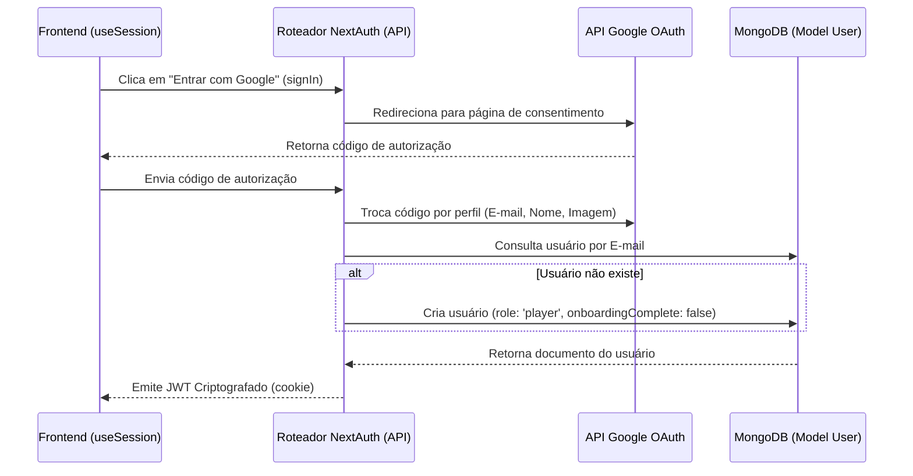

# Arquitetura de Autenticação: Google OAuth, MongoDB e Sincronização de Carteira

Este documento detalha como a autenticação, criação de usuários, atribuição de perfis e sincronização de carteiras Web3 funcionam no **ePass** utilizando NextAuth, Mongoose/MongoDB e JWT.

---

## 1. Fluxo Completo de Login e Criação de Usuário

Quando um usuário faz login via Google OAuth, o backend mapeia sua identidade para um documento do MongoDB.

### Detalhamento do Fluxo
1. **Gatilho**: O frontend chama `signIn("google")`.
2. **Consentimento**: O NextAuth lida com o redirecionamento do navegador para a página do Google OAuth e recebe os dados de perfil (e-mail, nome, imagem).
3. **Consulta de Banco de Dados e Registro**:
   * O NextAuth intercepta esse fluxo no callback `jwt` (onde os objetos `account` e `user?.email` estão presentes no primeiro login).
   * Executa a função `dbConnect()` e faz a query `User.findOne({ email: user.email })`.
   * Se o usuário não existir no banco, um novo registro é criado com o perfil padrão de `'player'` e `onboardingComplete: false`.
4. **Geração de Token**: O `_id` gerado pelo MongoDB é convertido para string e injetado em `token.id`. O perfil do usuário é atribuído a `token.role`.

---

## 2. Ciclo de Vida do JWT e Sessão

Utilizamos sessões baseadas em JWT. Os dados da sessão são criptografados e armazenados em um cookie seguro (HTTP-only) no navegador do usuário.

### Callback `jwt`
O callback `jwt` gerencia:
1. **Login Inicial**: Executa as checagens no banco de dados, cria novos usuários e grava o `_id` (`token.id`) e perfil (`token.role`) no payload do token.
2. **Associação de Carteira (`trigger === "update"`)**:
   * Quando o jogador ou clube vincula sua carteira na etapa de onboarding, o frontend chama o método `update()` do NextAuth enviando o novo endereço.
   * O callback intercepta essa alteração e anexa o `walletAddress` ao token.
3. **Atualização de Perfil e E-mail**:
   * Durante eventos com o gatilho "update", se `token.id` estiver presente, o banco é consultado para recuperar os valores mais recentes de `role` e `email`, garantindo que o token não fique desatualizado em relação ao banco de dados.

### Callback `session`
Expõe atributos do JWT descriptografado para a aplicação no lado do cliente:
* `session.user.id` (ID do MongoDB como string)
* `session.user.role` (`"player" | "club"`)
* `session.user.walletAddress` (endereço de carteira vinculada)

---

## 3. Transformação de Dados: Evolução da Identidade

| Etapa | Nome do Atributo | Origem | Descrição |
| :--- | :--- | :--- | :--- |
| **Perfil Google** | `profile.email` | Google | Utilizado para consultar ou registrar o usuário no MongoDB. |
| **Documento do Banco** | `dbUser._id` | MongoDB | Identificador único gerado automaticamente pelo banco de dados. |
| **Token Criptografado** | `token.id`, `token.role` | Callback `jwt` do NextAuth | Payload embutido dentro do cookie seguro. |
| **Sessão da Aplicação** | `session.user.id`, `session.user.role` | Callback `session` do NextAuth | Exposto para componentes cliente e servidor. |
| **Sessão Web3** | `session.user.walletAddress` | Gatilho dinâmico "update" | Sincroniza a carteira Web3 conectada à sessão do NextAuth. |
