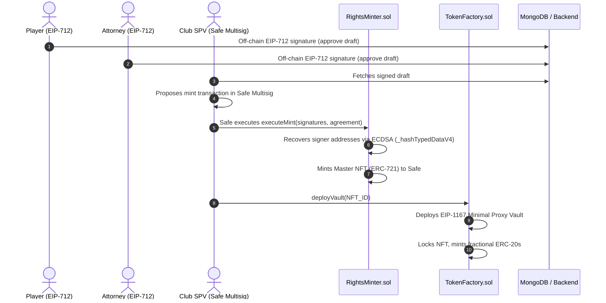

# Architectural Studies: On-Chain Football Rights Tokenization, Multi-Sig, & Web3 Integrations

This document compiles the research, design decisions, and structural analysis conducted during the development of the **ePass** platform. It covers our stack choices, authentication models, contract lifecycle, multi-sig execution, and the final RWA (Real World Asset) securitisation model.

---

## 1. Core Technology Stack & Developer Tooling

To build a secure, high-performance on-chain football marketplace, we researched and integrated the following technologies:

### Frontend & Web3 Providers
* **React 19 & Next.js 16 (App Router)**: Leveraged for server-side rendering (SSR), optimized bundle sizes, and native React Server Components (RSC) to handle secure queries to our database.
* **Wagmi & Viem**: Used instead of legacy libraries (like ethers.js) due to native TypeScript support, optimized JSON-RPC interactions, lightweight bundle footprint, and robust support for EIP-712 structured data signing.
* **RainbowKit**: Integrated for Web3 wallet connection management.
* **Tailwind CSS v4 & PostCSS**: Custom theme implementation utilizing OKLCH color definitions for modern aesthetics (Neon-Forest Web3 visual identity).

### Smart Contract Development & Testing
* **Foundry**: Selected as the primary suite for compiling, testing, and deploying Ethereum smart contracts. High-speed unit testing written in Solidity allows for rapid iteration.
* **Hardhat**: Utilized in tandem for plugin support, local EVM node simulation (via Anvil or Hardhat Node), and integration testing with front-end mock contexts.

---

## 2. Authentication & Identity: Local Wallets vs. Hybrid OAuth

One of our primary research topics was balancing user onboarding friction (Web2) with cryptographic auditability (Web3).

### Authentication Models Evaluated

1. **Pure Web3 Wallet-Only Authentication (Local/SIWE)**
   * *Pros*: Cryptographically secure; users retain custody of their identity.
   * *Cons*: Extreme onboarding friction for Web2-centric users (players, agents, sports lawyers) who may not have Web3 wallets or understand gas fees.
2. **Standard Web2 Email/Password Authentication**
   * *Pros*: Easy onboarding.
   * *Cons*: Fails to link identity directly with blockchain transactions, requiring a centralized custodian to handle on-chain signatures.
3. **Hybrid Model (NextAuth.js + Google OAuth + Dynamic Wallet Association)**
   * *Pros*: Users can register instantly using Google. The system links their profile to a MongoDB database. When they connect a wallet (e.g., MetaMask, Safe), the session dynamically updates to verify and map their cryptographic address.
   * *Cons*: Requires managing sync states between Web2 sessions and Web3 wallet addresses.

### The Chosen Implementation
We implemented the **Hybrid Model**. The application uses **NextAuth.js** (configured with a Google OAuth provider) to map user profiles. 
* On initial registration, the user receives a default role (`'player'`) and `onboardingComplete: false`.
* During onboarding, the user links their Web3 wallet. The frontend invokes an `update()` method to securely inject and verify the connected `walletAddress` within the encrypted JWT cookie session.

---

## 3. Stakeholder Workflows: Player vs. Club

To make the platform functional in real-world scenarios, we designed two distinct flows tailored to each stakeholder’s level of technical maturity:

### The Player (and Attorney) Flow
* **Target Audience**: Pessoas físicas (individuals). They expect a simple, mobile-friendly interface.
* **Mechanism**: **EIP-712 Structured Raw Signatures**.
* **Experience**: The player opens the ePass app on their phone, reviews the terms of the agreement (image rights, percentage, duration), and signs the data off-chain using their wallet app (e.g., WalletConnect, MetaMask). This is gasless and doesn't write to the blockchain immediately, keeping the database updated with their verified intent.

### The Club Flow (Special Purpose Vehicle - SPV)
* **Target Audience**: Entities/Corporations. They require strict corporate governance and multi-party approval.
* **Mechanism**: **Multi-Signature Smart Accounts (Safe / Gnosis Safe)**.
* **Experience**: A single club administrator proposes the transaction on-chain. The club's Safe multisig account holds the transaction payload in queue. The club board members log in to their Safe dashboard to verify and approve the proposal. Once the signature threshold is met, the transaction executes, paying the gas fees and minting/collecting the assets.

---

## 4. On-Chain Execution Flow & Lifecycle

The lifecycle of an agreement tokenization progresses through distinct off-chain and on-chain phases:

### Signature Verification & Cryptography
* **`MINT_AGREEMENT_TYPEHASH`**: We define the exact schema structure of a `MintAgreement` (defining `player`, `club`, `attorney`, `nonce`, `deadline`). This guarantees that the signed payload cannot be tampered with.
* **EIP-712 Domain Separator**: Handled via `_hashTypedDataV4` to prevent replay attacks across different chains (e.g., a signature signed on Testnet cannot be replayed on Mainnet).
* **Nonces**: Inherited from OpenZeppelin to ensure each unique agreement can only be settled on-chain exactly once.

---

## 5. Conclusion: The Final Model Reached

Through our architectural studies, we synthesized a model designed to bridge real-world sports contracts with decentralized finance. 

### RWA Securitisation Flow

1. **The Legal Wrapper**: A Special Purpose Vehicle (SPV) is created off-chain. The player legally assigns their image rights and future receivables to this SPV. The smart contract owns the SPV, which in turn legally owns the rights.
2. **Multi-Party Consent**: The player, club, and legal attorney execute structured signatures off-chain via EIP-712.
3. **NFT Minting**: The `RightsMinter` contract validates the signatures and mints an ERC-721 token representing the legal contract. The NFT is deposited directly into a Safe multisig vault owned by the SPV.
4. **Fractionalization**: The ERC-721 is locked inside a specialized `Vault` deployed by the `TokenFactory`. The vault uses the **EIP-1167 Minimal Proxy Pattern** to deploy lightweight, gas-efficient clones of ERC-20 tokens (e.g., `$P_NEYMAR`) representing shares of the asset.
5. **Liquidity Release**: The fractional ERC-20s are deposited into DeFi liquidity/lending pools (e.g., Aave fork) as collateral, releasing stablecoins (USDC) immediately to fund the club's operations.
6. **Yield Distribution**: As world-world sponsorship revenues are paid to the SPV in fiat, they are converted to USDC and sent to the Vault. The Vault distributes the yields proportionally to all `$P_IMAGE` token holders.

### Technical Trade-offs & Selected Standard
We evaluated multiple ERC standards for tokenizing the receivables:
* **ERC-721**: Ideal for representing the master legal contract 1:1, but lacks liquidity.
* **ERC-1155**: Good for native fractionalization, but suffers from lower integration support in traditional DeFi lending protocols.
* **ERC-3525**: Highly flexible for financial bonds, but requires custom wrappers for existing DEXs.

**Our Verdict**: We chose a **hybrid fractional model (ERC-721 Master NFT locked in a Vault, emitting ERC-20 fractions)**. This yields the best of both worlds: perfect legal representation via the NFT, and maximum liquidity/compatibility with existing Uniswap and lending protocols via ERC-20.

### Real-World Asset Valuation
To reflect the value of the athlete safely on-chain, we designed a dual oracle vector:
* **Market-Driven Speculative Value**: Tracked via **Uniswap V3 Time-Weighted Average Price (TWAP)** oracles based on the trading activity of the player's ERC-20 token.
* **Performance-Driven Yield Oracles**: Sports API integrations feeding performance data (goals, injury status, social media reach) directly into the smart contracts. This dynamically adjusts lending interest rates or triggers performance-based dividend distributions to fractional token holders.