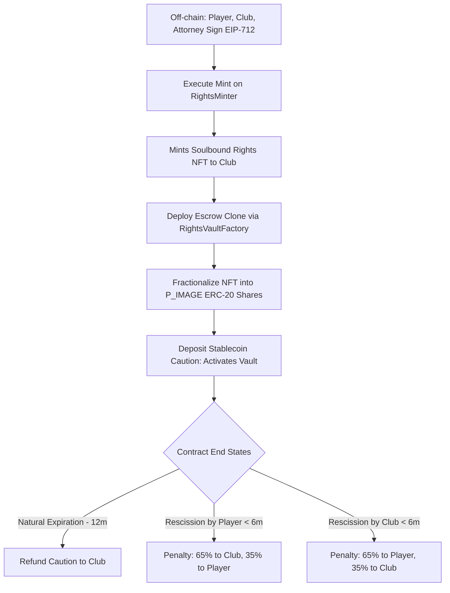

# ePass Smart Contract Architecture: Technical Deep Dive

This document provides a comprehensive technical analysis of the **ePass** image rights management and escrow system. It details the smart contract pipeline, the integration of EIP-712 signatures, the use of ERC-1167 minimal proxies (clones), contract lifecycle states, potential edge cases, and architectural recommendations.

---

## 1. Architectural Pipeline

The contract lifecycle follows a multi-stage flow that bridges off-chain digital agreement signatures with on-chain cryptographic enforcement and asset fractionalization.



### Stage 1: Off-Chain Negotiation & Signing
1. The **Club** specifies the agreement parameters: `player`, `club`, `attorney`, `tokenURI` (containing the contract document IPFS metadata), `nonce`, and `deadline`.
2. All three parties (Player, Club, and Attorney) verify the details and sign the structured EIP-712 data in their respective web3 browsers.

### Stage 2: Minting & Validation (`RightsMinter.sol`)
1. The Club calls `executeMint()` on the `RightsMinter` contract, submitting the structured parameters and the three signatures.
2. The contract cryptographically recovers the signers using `ecrecover` (via OpenZeppelin's `ECDSA` and `_hashTypedDataV4`).
3. If valid, the player's nonce is consumed, and the minter calls the `PlayerRightsMaster` NFT contract to mint a new token representing the rights.
4. The NFT is minted directly to the **Club** (representing their initial legal claim).

### Stage 3: Vault Deployment (`RightsVaultFactory.sol`)
1. To establish the payment and security escrow, the Club deploys a new vault via the `RightsVaultFactory`.
2. The factory clones the pre-deployed logic contract (`RightsVaultImpl`) using the **ERC-1167 Minimal Proxy** standard and initializes it.
3. The vault clone maps the rights shares (in basis points) to the Player, Club, and Attorney.

### Stage 4: Locking & Fractionalization (`RightsVaultImpl.sol` - Clone)
1. The Club transfers the `PlayerRightsMaster` NFT into the newly created vault clone.
2. Upon receiving the NFT, the vault locks it and mints `P_IMAGE` ERC-20 utility tokens representing fractional ownership shares.
3. The minted shares are distributed to the three wallets according to the basis points configured at initialization.

### Stage 5: Activation & Caution Deposit (`RightsVaultImpl.sol` - Clone)
1. The Club deposits the required caution amount in a supported stablecoin (e.g. USDC) into the vault clone via `depositCaution()`.
2. This switches the status from `PENDING` to `ACTIVE` and starts the contract duration timer.

---

## 2. Deep Dive: ERC-1167 Minimal Proxies (Clones)

To make deploying a dedicated escrow vault for every player contract economically viable, the architecture relies on **ERC-1167 Minimal Proxies** (via OpenZeppelin's `Clones` library).

### How It Works
Instead of deploying the full bytecode of the vault logic (~19KB of compilation results) for every contract—which would cost millions of gas—the factory deploys a lightweight proxy (~45 bytes).

```
1. Client Call ──> 2. Minimal Proxy (EIP-1167) ──[ DELEGATECALL ]──> 3. RightsVaultImpl (Logic)
                        │                                                   │
                        └───> Reads/Writes to Proxy Storage <───────────────┘
```

The minimal proxy contains a simple runtime bytecode sequence that performs a `DELEGATECALL` to the pre-deployed implementation contract (`RightsVaultImpl`):

```bytecode
363d3d373d3d3d363d73[20-byte-implementation-address]5af43d82803e903d91602b57fd5bf3
```

- **Execution Context**: When functions (like `depositCaution` or `rescindByPlayer`) are called on the proxy address, the code is executed on the implementation contract, but it runs in the **context of the proxy's storage**. Thus, state variables (like `player`, `club`, `status`, and `cautionAmount`) are written to the proxy's own storage slots.
- **Gas Comparison**:
  - Full Contract Deploy: ~1,500,000–2,500,000 gas.
  - ERC-1167 Clone Deploy: ~60,000–80,000 gas (over **95% gas savings**).

### Technical Constraints of Clones

1. **No constructor Parameters**: Since clone deployment does not execute a constructor (it just copies the bytecode pointing to the implementation), we cannot use `constructor` arguments. All configuration must happen in an `initialize` function.
2. **Initializer Protection**: The `initialize` function must be guarded by the `initializer` modifier (from `@openzeppelin/contracts-upgradeable`) to ensure it can only be called once.
3. **No Immutable Variables**: Immutables (declared using `immutable` in Solidity) are compiled directly into the bytecode. Because clones share the implementation's bytecode, they cannot have instance-specific immutable values. Any variables that would normally be immutable (like the address of the stablecoin or NFT master) must be stored in regular state slots.
4. **Safety from Implementation Sabotage**: The constructor of the logic contract itself is disabled using `_disableInitializers()` (line 124 in `RightsVaultImpl.sol`). This prevents attackers from calling `initialize` directly on the implementation address and executing self-destruct or other malicious configuration changes.

---

## 3. Multisig EIP-712 Verification

The `RightsMinter` leverages EIP-712 to enable secure, gasless off-chain approvals.

### The Typed Domain Separator
EIP-712 signatures are bound to a specific application domain to prevent replay attacks on other applications or chains. The separator is built dynamically:

```typescript
const domain = {
    name: "RightsMinter",
    version: "1",
    chainId: chainId,
    verifyingContract: verifyingContractAddress,
}
```

### Struct Hashing
The data is hashed strictly matching the Solidity definition:

$$\text{hash} = \text{keccak256}(\text{abi.encode}(\text{TYPEHASH}, \text{player}, \text{club}, \text{attorney}, \text{keccak256}(\text{tokenURI}), \text{nonce}, \text{deadline}))$$

The double hashing of the `string tokenURI` using `keccak256(bytes(tokenURI))` is mandatory for dynamic types in EIP-712.

---

## 4. Contract Lifecycle & Escrow Logic

The vault manages stablecoin deposits under strict temporal rules:

1. **Natural Expiration (`expireContract`)**:
   - Requires the duration to pass (`365 days` + `1 day` buffer).
   - Refunds the **100% caution deposit** to the Club.
2. **Rescission (Termination)**:
   - **First Half-Time (Before 6 months + 1 day buffer)**:
     - If player terminates (`rescindByPlayer`): Penalty applies. **65%** is sent to the Club, **35%** goes to the Player.
     - If club terminates (`rescindByClub`): Penalty applies. **65%** is sent to the Player, **35%** goes to the Club.
   - **Second Half-Time (After 6 months + 1 day buffer)**:
     - No penalties apply. The entire caution deposit (100%) is returned to the **Club**, acknowledging that the contract was mostly completed.

---

## 5. Security Vulnerabilities & Edge Cases

### 2. Free Transferability of `P_IMAGE` ERC-20 Tokens
While the `PlayerRightsMaster` NFT has restricted transferability (soulbound to approved operators via line 50 of `PlayerRightsMaster.sol`), the vault clone mints standard `ERC20Upgradeable` tokens (`P_IMAGE`) to represent fractional rights ownership:
- **The Issue**: These fractional shares can be freely transferred (`transfer`, `transferFrom`) by the player, club, or attorney to any arbitrary wallet address.
- **Result**: The ownership of the image rights fractions can be sold or traded on open markets (e.g. Uniswap) without the platform's consent, potentially bypassing the soulbound/legal transfer restrictions intended for the master NFT.
- **Remediation**: If fractional shares should be non-transferable or only transferable to authorized entities, override the `_update` or `transfer`/`transferFrom` functions in `RightsVaultImpl.sol` to restrict transferability.

### 3. Frontrunning Vault Initialization
When `createVault()` is called in the Factory, it deploys the clone and calls `initialize()` in the same transaction.
- **The Issue**: If deployment and initialization were separated into two external transactions, an attacker could watch the mempool, frontrun the transaction, and initialize the clone with their own addresses.
- **Current Status**: Safe, because `createVault()` does both operations atomically in a single transaction.

### 4. Timestamp Manipulation Risk
The contract relies on `block.timestamp` to determine the 6-month half-time and 12-month expiration.
- **The Issue**: Ethereum validators can manipulate block timestamps slightly (usually within a 15-second window).
- **Current Status**: Safe. Since the contract uses a 1-day buffer (`TIMESTAMP_BUFFER = 1 days`), minor validator manipulation (seconds) cannot trigger premature transitions.

---

## 6. Recommendations & Improvements

1. **Multisig Nonces**: Modify `RightsMinter` to track and increment nonces for the club and attorney, or bundle them into a single hash representation that prevents signature replay.
2. **Transfer Restrictive ERC-20**: Hook into the ERC-20 transfer hook in `RightsVaultImpl.sol` to enforce that `P_IMAGE` tokens can only be transferred to KYC-verified addresses or approved parties.
3. **Emergency Rescue**: If a player connects a wrong wallet or loses access, implement an admin-controlled emergency escape mechanism (governed by the factory owner) to rescue locked NFTs.
