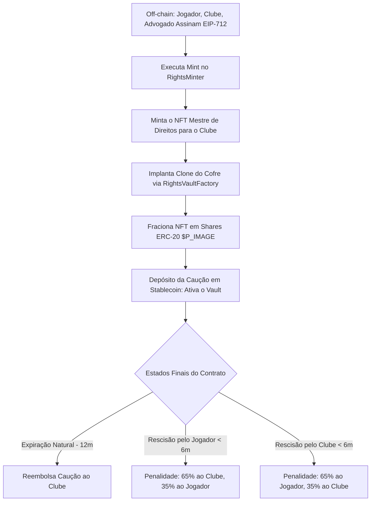

# 📘 2 - Resumo Detalhado: Ciclo de Vida dos Contratos, UI e Otimizações

Este documento fornece um resumo detalhado e aprofundado do pipeline do **ePass**, focando na implementação do ciclo de vida do cofre on-chain, nas otimizações do compilador TypeScript e na integração completa dos fluxos de transação na interface do usuário (UI).

Para a visão geral técnica, arquitetura de chamadas e referências de funções dos contratos, consulte o [1 - Mini Doc Técnica](./TECH-DOC.md).

---

## 🏗️ 1. Pipeline Arquitetural do Protocolo

O ciclo de vida do contrato segue um fluxo de várias etapas que conecta assinaturas digitais de acordos off-chain com execução criptográfica on-chain e fracionamento de ativos.



### Etapa 1: Negociação & Assinatura Off-Chain
1. O clube especifica os parâmetros do acordo: `player` (jogador), `club` (clube), `attorney` (advogado), `tokenURI` (contendo os metadados do documento do contrato no IPFS), `nonce` e `deadline`.
2. Todas as três partes (Jogador, Clube e Advogado) verificam os detalhes e assinam os dados estruturados do EIP-712 em seus respectivos navegadores web3.

### Etapa 2: Validação & Minting (`RightsMinter.sol`)
1. O Clube chama `executeMint()` no contrato `RightsMinter`, enviando os parâmetros estruturados e as três assinaturas.
2. O contrato recupera criptograficamente os signatários usando `ecrecover` (via `ECDSA` e `_hashTypedDataV4` da OpenZeppelin).
3. Se for válido, o nonce do jogador é consumido e o minter chama o contrato NFT `PlayerRightsMaster` para mintar um novo token representando os direitos.
4. O NFT é mintado diretamente para o Clube (representando sua reivindicação jurídica inicial).

### Etapa 3: Implantação do Vault (`RightsVaultFactory.sol`)
1. Para estabelecer o pagamento e a garantia (caução), o Clube implanta um novo cofre (vault) via `RightsVaultFactory`.
2. A factory clona o contrato de lógica pré-implantado (`RightsVaultImpl`) usando o padrão **Minimal Proxy ERC-1167** e o inicializa.
3. O clone do vault mapeia as frações dos direitos (em basis points) para o Jogador, Clube e Advogado.

### Etapa 4: Bloqueio & Fracionamento (`RightsVaultImpl.sol` - Clone)
1. O Clube transfere o NFT do `PlayerRightsMaster` para o clone do vault recém-criado.
2. Ao receber o NFT, o vault o bloqueia e minta tokens utilitários ERC-20 `$P_IMAGE` que representam frações de propriedade dos direitos.
3. As frações mintadas são distribuídas para as três carteiras de acordo com os basis points configurados na inicialização.

### Etapa 5: Ativação & Depósito da Caução (`RightsVaultImpl.sol` - Clone)
1. O Clube deposita o valor da caução exigida em uma stablecoin suportada (ex: USDC) no clone do vault via `depositCaution()`.
2. Isso altera o status de `PENDING` para `ACTIVE` e inicia o cronômetro de duração do contrato.

---

## 👥 2. Proxies Mínimos ERC-1167 (Clones)

Para tornar economicamente viável a implantação de um vault de garantia dedicado para cada contrato de jogador, a arquitetura baseia-se em **Proxies Mínimos ERC-1167** (via biblioteca `Clones` da OpenZeppelin).

### Como Funciona
Em vez de implantar todo o bytecode do contrato de lógica do vault (~19KB de resultado de compilação) para cada contrato — o que custaria milhões em gas — a factory implanta um proxy leve (~45 bytes).

```
1. Chamada do Cliente ──> 2. Proxy Mínimo (EIP-1167) ──[ DELEGATECALL ]──> 3. RightsVaultImpl (Lógica)
                               │                                                   │
                               └───> Lê/Escreve no Storage do Proxy <──────────────┘
```

O proxy mínimo contém uma sequência simples de bytecode de runtime que realiza um `DELEGATECALL` para o contrato de implementação pré-implantado (`RightsVaultImpl`):

```bytecode
363d3d373d3d3d363d73[endereço-da-implementação-com-20-bytes]5af43d82803e903d91602b57fd5bf3
```

- **Contexto de Execução**: Quando funções (como `depositCaution` ou `rescindByPlayer`) são chamadas no endereço do proxy, o código é executado no contrato de implementação, mas roda no **contexto de armazenamento (storage) do proxy**. Assim, as variáveis de estado (como `player`, `club`, `status` e `cautionAmount`) são gravadas nos slots de armazenamento do próprio proxy.
- **Comparação de Gas**:
  - Implantação de contrato completo: ~1.500.000–2.500.000 gas.
  - Implantação de clone ERC-1167: ~60.000–80.000 gas (mais de **95% de economia de gas**).

### Restrições Técnicas dos Clones
1. **Sem Parâmetros no Construtor**: Como a implantação de clones não executa um construtor (apenas copia o bytecode que aponta para a implementação), não podemos usar argumentos de `constructor`. Toda a configuração deve ocorrer em uma função `initialize`.
2. **Proteção do Inicializador**: A função `initialize` deve ser protegida pelo modificador `initializer` (de `@openzeppelin/contracts-upgradeable`) para garantir que só possa ser chamada uma única vez.
3. **Sem Variáveis Imutáveis**: Variáveis imutáveis (declaradas usando `immutable` no Solidity) são compiladas diretamente no bytecode. Como os clones compartilham o bytecode da implementação, eles não podem ter valores imutáveis específicos de cada instância. Qualquer variável que normalmente seria imutável (como o endereço da stablecoin ou do NFT mestre) deve ser armazenada como variável de estado comum.
4. **Segurança contra Sabotagem da Implementação**: O construtor do contrato de lógica em si é desativado usando `_disableInitializers()` no `RightsVaultImpl.sol`. Isso evita que atacantes chamem `initialize` diretamente no endereço de implementação e executem self-destruct ou outras alterações de configuração maliciosas.

---

## 🔐 3. Verificação de Assinatura Tripla EIP-712

O `RightsMinter` utiliza EIP-712 para permitir aprovações seguras e sem taxas de gas off-chain.

### Separador de Domínio Tipado (Domain Separator)
As assinaturas EIP-712 são vinculadas a um domínio de aplicação específico para evitar ataques de replay em outras aplicações ou redes. O separador é construído dinamicamente:

```typescript
const domain = {
    name: "RightsMinter",
    version: "1",
    chainId: chainId,
    verifyingContract: verifyingContractAddress,
}
```

### Hashing da Estrutura
Os dados são hasheados correspondendo estritamente à definição no Solidity:

$$\text{hash} = \text{keccak256}(\text{abi.encode}(\text{TYPEHASH}, \text{player}, \text{club}, \text{attorney}, \text{keccak256}(\text{tokenURI}), \text{nonce}, \text{deadline}))$$

O hash duplo da `string tokenURI` usando `keccak256(bytes(tokenURI))` é obrigatório para tipos dinâmicos no EIP-712.

---

## ⏱️ 4. Ciclo de Vida do Contrato e Lógica de Caução (Escrow)

O vault gerencia os depósitos de stablecoins sob regras temporais estritas:

1. **Expiração Natural (`expireContract`)**:
   - Requer que o período de duração tenha decorrido (`365 dias` + `1 dia` de buffer).
   - Devolve **100% da caução** para o Clube.
2. **Rescisão (Rescisão antecipada)**:
   - **Primeiro Semestre (Antes de 6 meses + 1 dia de buffer)**:
     - Se o jogador rescindir (`rescindByPlayer`): Penalidade é aplicada. **65%** é enviado para o Clube e **35%** vai para o Jogador.
     - Se o clube rescindir (`rescindByClub`): Penalidade é aplicada. **65%** é enviado para o Jogador e **35%** vai para o Clube.
   - **Segundo Semestre (Após 6 meses + 1 dia de buffer)**:
     - Não se aplicam penalidades. Toda a caução depositada (100%) é devolvida ao **Clube**, reconhecendo que o contrato foi substancialmente cumprido.

---

## 🛡️ 5. Vulnerabilidades de Segurança e Casos Limite

### Livre Transferibilidade dos Tokens ERC-20 `P_IMAGE`
- Enquanto o NFT `PlayerRightsMaster` possui transferibilidade restrita (vinculada a operadores aprovados), o clone do vault emite tokens `ERC20Upgradeable` padrão (`P_IMAGE`) para representar as frações dos direitos.
- **O Problema**: Essas frações podem ser livremente transferidas (`transfer`, `transferFrom`) pelo jogador, clube ou advogado para qualquer carteira arbitrária.
- **Resultado**: A propriedade das frações dos direitos de imagem pode ser vendida ou negociada em mercados abertos (ex: Uniswap) sem o consentimento da plataforma, potencialmente contornando as restrições de transferência pretendidas para o NFT mestre.
- **Remediação**: Se as frações não devessem ser transferíveis ou apenas transferíveis para entidades autorizadas, deve-se sobrescrever as funções `_update` ou `transfer`/`transferFrom` no `RightsVaultImpl.sol`.

### Frontrunning na Inicialização do Vault
- Quando `createVault()` é chamado na Factory, ela implanta o clone e chama `initialize()` na mesma transação.
- **O Problema**: Se a implantação e a inicialização fossem separadas em duas transações externas, um invasor poderia monitorar o mempool, fazer frontrun na transação e inicializar o clone com seus próprios endereços.
- **Status Atual**: Seguro, porque `createVault()` realiza ambas as operações atomicamente em uma única transação.

### Risco de Manipulação de Timestamp
- O contrato depende de `block.timestamp` para determinar a metade do tempo (6 meses) e a expiração (12 meses).
- **O Problema**: Validadores do Ethereum podem manipular ligeiramente os timestamps dos blocos (geralmente dentro de uma janela de 15 segundos).
- **Status Atual**: Seguro. Como o contrato usa um buffer de 1 dia (`TIMESTAMP_BUFFER = 1 days`), manipulações menores dos validadores (segundos) não podem desencadear transições prematuras.

---

## ⚙️ 6. Otimização do Sistema de Build e TypeScript

- Durante o processo de build, o compilador do Next.js falhava devido a problemas de targeting com literais `BigInt`. O projeto originalmente mirava `ES2017` no `tsconfig.json`. Como o Wagmi, Viem e os contratos inteligentes do ePass utilizam extensivamente valores `uint256` representados como literais `BigInt` no Javascript (ex: `3000n`, `6000n`, `1000n`), o compilador de TypeScript lançava:
  > `Type error: BigInt literals are not available when targeting lower than ES2020.`
- **Solução Implementada**:
  - Atualizado de `"target": "ES2017"` para `"target": "ES2022"` no `tsconfig.json`.
  - Isso ativa o suporte nativo para literais `BigInt` e alinha o compilador com os runtimes modernos dos navegadores e com os recursos da versão do Next.js.
  - A aplicação compila com sucesso e todas as páginas são construídas dinamicamente durante a otimização de produção.

---

## 🪝 7. Integração de Hooks On-Chain

Uma série de hooks de leitura e escrita gerados a partir do output de compilação do Foundry (`src/generated.ts`) foram integrados na página de detalhes do contrato:

- **Imports adicionados**:
  ```typescript
  import { 
      useWriteRightsVaultImplRescindByPlayer,
      useWriteRightsVaultImplRescindByClub,
      useWriteRightsVaultImplExpireContract,
      useReadRightsVaultImplTimeRemaining,
      useReadRightsVaultImplIsBeforeHalfTime,
      // ... hooks preexistentes
  } from "@/src/generated";
  ```
- **Instanciação**:
  1. **Leituras**:
     - `useReadRightsVaultImplTimeRemaining`: Busca os segundos restantes da duração de 12 meses do contrato no clone do vault.
     - `useReadRightsVaultImplIsBeforeHalfTime`: Compara se o timestamp do bloco ativo ultrapassou o limite de penalidade (6 meses).
  2. **Mutações (Escritas)**:
     - `useWriteRightsVaultImplRescindByPlayer`: Executa o método `rescindByPlayer()`.
     - `useWriteRightsVaultImplRescindByClub`: Executa o método `rescindByClub()`.
     - `useWriteRightsVaultImplExpireContract`: Executa o método `expireContract()`.

---

## 🔁 8. Pipeline de Sincronização de Dados

Para garantir que a interface reflita o estado do bloco corretamente sem recarregamentos manuais, os hooks de leitura foram integrados diretamente no ciclo de atualização da página:

```typescript
const fetchAgreement = async () => {
    const res = await getAgreement(id);
    if (res.success) {
        setAgreement(res.agreement);
        refetchApproved?.();
        refetchAuthorized?.();
        refetchAllowance?.();
        refetchUsdcBalance?.();
        refetchTimeRemaining?.();
        refetchHalfTime?.();
    }
    setLoading(false);
};
```

Sempre que uma transação é concluída com sucesso, esta pipeline:
1. Recarrega o status do banco de dados.
2. Atualiza a aprovação do NFT e o status do operador no contrato mestre.
3. Atualiza o saldo de USDC e a permissão (allowance) do usuário ativo.
4. Atualiza o tempo restante e os sinalizadores de metade do tempo a partir do clone de proxy do vault.

---

## 🖥️ 9. Fluxo de Transação de Caução (Passo a Passo na UI)

A página agora gerencia todo o ciclo de vida do contrato de caução, cobrindo as fases de transição para três status:

### A. O Status ACTIVE
Quando o status do acordo é `active`, o depósito da caução está bloqueado dentro do clone do vault de garantia (proxy EIP-1167). A interface exibe o painel de rastreamento do contrato ativo:

- **Painel de Status Ativo**:
  - Exibe um badge verde pulsante `● Live`.
  - Calcula e formata o tempo restante em dias e horas:
    $$\text{Dias} = \lfloor\text{timeRemaining} / 86400\rfloor$$
    $$\text{Horas} = \lfloor(\text{timeRemaining} \pmod{86400}) / 3600\rfloor$$
  - Exibe a fase atual do contrato, alertando o usuário se há aplicação de penalidade (Primeiro Semestre vs Segundo Semestre).
- **Opções de Rescisão (Encerramento)**:
  - Renderizados como componentes condicionais `ActionCard`.
  - **Como Jogador**: Visível apenas para o endereço de carteira do jogador. Detalha a distribuição financeira se executada (65% para o Clube, 35% para o Jogador antes de 6 meses; 100% para o Clube após).
  - **Como Clube**: Visível apenas para o endereço de carteira do clube. Explica as regras de penalidade (65% para o Jogador, 35% para o Clube antes de 6 meses; 100% para o Clube após).
- **Expiração Natural**:
  - Visível para todas as carteiras conectadas.
  - Dispara uma ação de `Finalizar Acordo` (Expire Agreement) quando `timeRemaining === 0n`. Finalizar o contrato envia 100% da caução de stablecoins de volta ao clube.

### B. O Status RESCINDED
Quando qualquer uma das partes executa a rescisão, o status da transação é updated on-chain. Após a confirmação:
1. A action de servidor atualiza o status no banco de dados MongoDB para `rescinded`.
2. A UI renderiza um painel explicativo informando ao usuário que o contrato foi rescindido e os fundos de garantia foram distribuídos.

### C. O Status EXPIRED
Quando o contrato expira naturalmente e a finalização é executada:
1. O status do banco de dados é atualizado para `expired`.
2. A UI exibe um painel de sucesso confirmando a conclusão do ciclo de vida e a devolução total da caução ao Clube.

---

## 🎨 10. Integração de Layout na Interface (UI)

O bloco de ações na coluna principal foi expandido para suportar os novos estados:

```tsx
{/* Painel do Ciclo de Vida Ativo */}
{agreement.status === 'active' && (
    <div className="space-y-6">
        <div className="glass-panel p-6 rounded-xl space-y-6 border-primary/20 bg-primary/5">
            {/* Indicador Live, Tempo Restante, Fase do Contrato */}
        </div>

        {/* Ação de Rescisão para o Jogador */}
        {isPlayer && (
            <ActionCard
                title="Rescindir Acordo (como Jogador)"
                description={isBeforeHalfTime 
                    ? "Passo 1 de 1: Rescindir o acordo. Como está antes de 6 meses, uma penalidade de 65% da caução irá para o Clube, e você receberá 35%." 
                    : "Passo 1 of 1: Rescindir o acordo. Como está após 6 meses, a caução é devolvida ao Clube sem penalidade."
                }
                actionName="Rescindir Acordo"
                onAction={handleRescindByPlayer}
                status={actionStatus}
                // ... props
            />
        )}

        {/* Ação de Rescisão para o Clube */}
        {isClub && (
            <ActionCard
                title="Rescindir Acordo (como Clube)"
                description={isBeforeHalfTime 
                    ? "Passo 1 de 1: Rescindir o acordo. Como está antes de 6 meses, uma penalidade de 65% da caução irá para o Jogador, e você receberá 35%." 
                    : "Passo 1 of 1: Rescindir o acordo. Como está após 6 meses, a caução é devolvida a você sem penalidade."
                }
                actionName="Rescindir Acordo"
                onAction={handleRescindByClub}
                status={actionStatus}
                // ... props
            />
        )}

        {/* Ação de Expiração */}
        {timeRemaining !== undefined && timeRemaining === 0n && (
            <ActionCard
                title="Finalizar Acordo"
                description="O período do contrato foi concluído. Encerre o contrato on-chain para devolver 100% do depósito de garantia de volta ao Clube."
                actionName="Finalizar Acordo"
                onAction={handleExpireContract}
                status={actionStatus}
                // ... props
            />
        )}
    </div>
)}

{/* Painéis de UI para Rescinded e Expired */}
{agreement.status === 'rescinded' && ( ... )}
{agreement.status === 'expired' && ( ... )}
```
